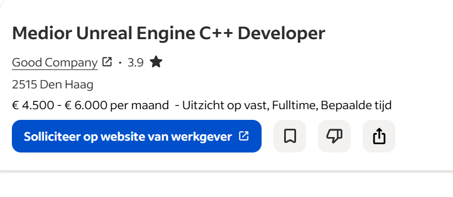
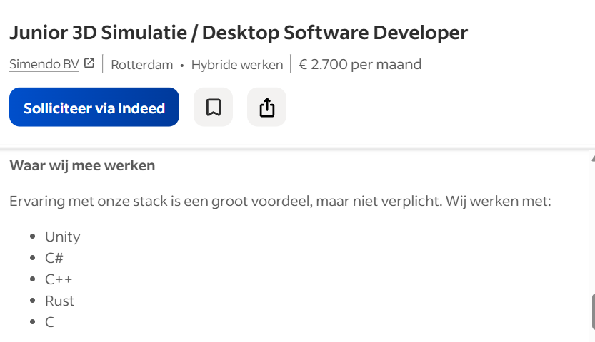
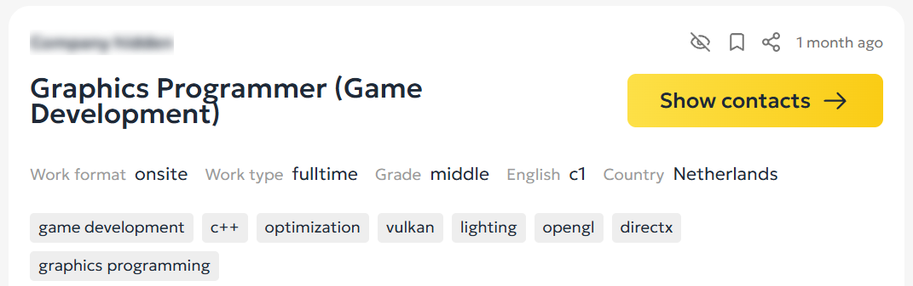

# Titel verslag

Versienummer : 1

Auteur : Pascal Reinders

Studentnummer : 0271098

Klas : 25SDBa1

Naam Keuzedeel: Verdieping Software Deel 2

Code Keuzedeel: K1315

Datum : 07/10/2026

---

## Inhoudsopgave

- [Titel verslag](#titel-verslag)
  - [Inhoudsopgave](#inhoudsopgave)
  - [Inleiding](#inleiding)
  - [Maakt een keuze voor software](#maakt-een-keuze-voor-software)
    - [Onderzoek](#onderzoek)
    - [Vergelijking](#vergelijking)
    - [Keuze](#keuze)
    - [Arbeidsmarkt](#arbeidsmarkt)
    - [Onderbouwing onderzoek en keuze](#onderbouwing-onderzoek-en-keuze)
  - [Maakt zich de software eigen](#maakt-zich-de-software-eigen)
    - [Reflectie](#reflectie)
      - [Wat weet ik?](#wat-weet-ik)
      - [Wat weet ik nog niet?](#wat-weet-ik-nog-niet)
      - [Wat wil ik nog leren uit deze verdieping software?](#wat-wil-ik-nog-leren-uit-deze-verdieping-software)
    - [Leerdoelen formuleren](#leerdoelen-formuleren)
    - [Prototype voorstel](#prototype-voorstel)
    - [Planning](#planning)
    - [Logboek](#logboek)
  - [Prototype](#prototype)
  - [Eindconclusie](#eindconclusie)
  - [Bronnen](#bronnen)
  - 

---

## Inleiding

Leren, in de progameerwereld kan je heel veel dingen leren wat later in de toekomst veel nut zal hebben. Bijvoorbeeld: specifieke frameworks, grafische software, game engines en voornamelijk programmeertalen. Ik ben Pascal Reinders, ik volg een opleiding om Game Developer te worden en dit is mijn tweede keuzedeel; Verdieping Software (Deel 2). In dit verslag neem ik jullie mee met dit traject om een nieuwe codetaal te leren vanaf **nul**.

## Maakt een keuze voor software

### Onderzoek

Een grondig onderzoek
Ik volg nu een game developer opleiding waar eigenlijk de programmeertaal: C#. Deze taal kan je gebruiken om de game engine Unity te gebruiken. Dus je vraagt jezelf nu waarschijnlijk waarom ik een andere codetaal wil leren. Niet elke bedrijf vraagt om C# en Unity, daarom vind ik het handig dat ik verder kijk naar wat bedrijven wel willen van een toekomstige game developer. Dit zijn dus de programmeertalen die ik zal vergelijken en daaruit komt een koploper: Rust, C++ en Java. Bij het stukje “Bronvermelding vacatures” kan je zien dat ik vacatures heb opgezocht voor mijn onderzoek.

Ik heb hiervoor een marktonderzoek gedaan zodat ik weet welke 3 programmeertalen het meest relevant zijn in de game development industrie.

Ik keek voor mijn eerste marktonderzoek op indeed voor een vacature die een van de benoemde programmeertalen bezit, de eerste die tevoorschijn kwam was een vacature die om een medior Unreal Engine C++ Developer vraagt, ik keek toen op de website en zag dat ze alleen iemand die Unreal Engine, C++ kennis heeft, wat mij ten eerste opviel is dat ze niet naar andere programmeertalen vroegen. Ten tweede valt mij op dat dit niet de enige vacature is die ik tegenkwam die C++ kennis vraagt.[^1]

Hierna keek ik voor mijn tweede marktonderzoek ook op indeed naar nog een vacature. Ik keek deze keer iets verder op indeed zelf en na een tijdje vond ik een vacature die een Junior 3D Simulatie / Desktop Software Developer zocht. Daaruit zag ik dat deze bedrijf zoekt naar iemand die Rust kennis heeft, dit bewijst dat er wel dat sommige bedrijven van je kunnen verwachten dat je Rust kan gebruiken.[^2]

Als laatst wou ik voor mijn derde marktonderzoek op het internet zelf kijken naar een vacature, maar wel deze keer uit het buitenland. Al snel kwam ik een nieuwe interessante vacature tegen die een Java Game Developer zocht. Wat ik interessant aan deze vacature vond is dat deze iemand met Java kennis zocht voor echte game development, niet veel bedrijven gebruiken Java voor game development. Alleen zegt deze bedrijf wel dat dit voor web games is.[^3]

Wat mij vooral heel erg opvalt nu dat ik het marktonderzoek heb beëindigd is dat echt heel veel bedrijven zoeken naar mensen die C++ kennis hebben. Ook de tweede vacature die bij de bronnen staat vraagt naar iemand die C++ kennis heeft. Alleen heeft vacature drie dit niet, want deze bedrijf vraagt ook om een game developer die web games wil maken en daarvoor heb je geen C++ voor nodig.
_Bron: Bronvermelding Bronvermelding Vacatures_

### Vergelijking

De grote vraag is nu; hoe gaan we een keuze maken tussen deze drie geweldige programmeertalen? Dat gaan we doen in verband met de voor- en nadelen die deze programmeertalen bezitten. We gaan dit doen met zeven relevante punten die ik als game developer belangrijk vindt, zodat ik de juiste taal kan vinden waar ik later veel aan heb op de werkvloer.

Hier is een uitleg wat deze relevante punten betekenen in de aankomende tabel:

1. Game Engine: Word deze taal gebruikt door een bekende Game Engine (met meeste gebruikers)?
2. Leergemak: Is deze taal makkelijk leerbaar?
3. Performance: hoe snel en soepel een game of programma draait bij deze codetaal?
4. Vraag op de arbeidsmarkt: word dit vaak teruggevraagd op de arbeidsmarkt?
5. Console Support: Geven console-fabrikanten directe ondersteuning en ontwikkelingstools voor deze taal?
6. Toegang tot Low-Level hardware: Laat de programmeertaal je de hardware en het geheugen tot in het extreme manipuleren, zonder dan de computer restricties oplegt?

---

| Programmeertalen                  | Rust                 | C++                  | Java                  |
| :-------------------------------- | :------------------- | :------------------- | :-------------------- |
| 1: Game Engines:                  | Matig [^4]           | Goed[^5]             | Slecht[^6]            |
| 2: Leergemak:                     | Matig[^7]            | Goed[^8]             | Slecht[^9]            |
| 3: Preformance:                   | Matig[^10]           | Goed[^10]            | Slecht[^11]           |
| 4: Vraag op de arbeidsmarkt:      | Matig[^12] (**139**) | Goed[^12] (**1068**) | Slecht[^12] (**438**) |
| 5: Console Support:               | Matig[^13]           | Goed[^14]            | Slecht[^15]           |
| 6: Toegang tot Low-Level hardware | Matig[^16]           | Goed[^17]            | Slecht[^18]           |
| **Programmeertalen**              | **Rust**             | **C++**              | **Java**              |

### Keuze

1: Game Engine:
Omdat je niet bij elke Engine kan zien wat de totale downloads en users zijn ga ik de meest populaire Engines zo vergelijken: De populairste Engine voor Rust is Bevy, de meeste downloads hierop zijn 7,65 miljoen. De populairste Engine voor C++ is Unreal Engine, in 2018 is er een blog geplaatst die zegt dat er in totaal 8 miljoen downloads in totaal zijn. De populairste Engine voor Java is Libgdx, er zijn geen totale downloads op internet bevestigd, dus gebruik ik de github als voorbeeld, ze hebben 6.5 duizend Forks en 25.5 duizend Stars. De conclusie die ik hieruit haar is dat Libgdx niet vaak wordt gebruikt, Bevy heeft in 2026 bevestigd 7,65 miljoen downloads en de koploper Unreal Engine had 8 miljoen downloads, wat nu in 2026 veel meer kan zijn. Dus C++ is hier het beste voor. [^4] [^5] [^6]

2: Leergemak:
Rust is zeker niet makkelijk te leven, want je hebt erg strenge regels van de compiler, wat het super lastig maakt om dit snel en makkelijk te leren. C++ is hierbij ook erg moeilijk om te leren, maar wel minder moeilijk dan rust, C++ is lastig door de complexe syntax en je moet je geheugen handmatig beheren, wat zeker niet beginner vriendelijk is. Java is wel supermakkelijk om onder de duim te krijgen, de syntax is gestructureerd en logisch wat het makkelijker maakt voor een beginner om het te leren. Hierbij verklaar ik Java het makkelijkste om te leren van de drie. [^7] [^8] [^9]

3: Performance:
C++ is een heel snelle programmeertaal, maar Rust komt daar meer dichterbij dan je denkt. Bij een test werd er dit getest: Task: Parse a 1GB JSON file containing 2 million log entries. Daaruit kwam C++ uit op 2.43 seconden en rust op 2.51. C++ won dit met 3.3%. Dus hierbij zie ik dat ze beide gelijk zijn aan elkaar, want het verschil is echt heel dichtbij. Maar hoe zit het met Java? In de Wikipedia “Java performance” staat gemeld dat Java historisch slomer is dan C en C++, dus hierbij concludeer ik dat Java niet beter is dan Rust en C++. [^10] [^11]

5: Console support:
Deze gedeelte van de onderzoek is erg interessant, want hieruit blijkt dat C++ volledig word ondersteunt door alle grote gaming consoles op de markt, maar Rust en de Engine Bevy supporten de gaming consoles totaal niet, Dit komt doordat de open-source aard van de engine botst met de strikte geheimhoudingsverklaringen van console van consolefabrikanten. En Java word totaal niet ondersteunt, daar word zelfs voor geadviseerd om alle Java code om te zetten naar C++ of C#. Dus C++ steekt hier bovenuit. [^13] [^14] [^15]

6: Toegang tot Low-Level hardware:
Java geeft je deze vrijheid niet, hardware-recourses worden compleet afgeschermd door de Java Vitrual Machine. Rust geeft je ook niet de totale vrijheid, want als je hardware of geheugen wilt manipuleren dwingt Rust je toe om het unsafe keyword te gebruiken. En C++ geeft je geen restricties, je progameert direct op het niveau van de chip. Dus hieruit verklaar ik uit alle vrijheid dat C++ het beste hieruit is. [^16] [^17] [^18]

### Arbeidsmarkt

4: Vraag op de arbeidsmarkt:
Deze vergelijking werkt heel simpel, ik heb op de site “gamesjobdirect” gekeken wat gespecializeerd is voor gamedevelopers die een baan zoeken over meerdere landen. En daaruit komen deze resultaten: Rust 139 vacatures, C++ 1068 vacatures en Java 438 vacatures. Mijn conclusie hieruit is dat C++ erg gewild is in de gamedev-markt, Java iets minder en Rust bijna helemaal niet. [^12]

Ook heel veel banen in Nederland zelf vragen je om C++ kennis te hebben, er zijn erg weinig gevallen dat Rust en Java teruggevraagd worden bij een een vacature.

### Onderbouwing onderzoek en keuze

Conclusie:
C++ is hierbij het beste, het heeft geen restricties, alle consoles supporten het, er is veel vraag naar op de arbeidsmarkt, het heeft de sterkste preformance en het gebruikt een hele populaire Game Engine: Unreal Engine. Enigste nadeel is dat het niet de makkelijkste taal die je kan leren is, maar dat maakt hem het wel waard met al deze voordelen.

Nog een manier om dit te bewijzen is in Indeed en een buitenlandse website keek, zocht ik naar passende vacatures, je kan zien bij de bronnen[^1][^2] dat er in beide vacatures staan dat ze verwachten dat je C++ weet en dat kunt toepassen. Dus daarom is dit een belangrijke codetaal om te weten voor een toekomste baan.

Dit is mijn conclusie, C++ word het onderwerp wat ik ga leren.

---

## Maakt zich de software eigen

### Reflectie

#### Wat weet ik?

- Ik weet dankzij C# en Javascript de basisconcept van progammeertalen. Voorbeelden zijn dus: variable data opslaan, if en else voor keuzes die de codetaal moet checken en loops om code te herhalen.
- Dankzij mijn onderzoek weet ik dat C++ geen automatische garbage collector heeft zoals Java, en geen strenge compiler-beveiliging zoals Rust. Door deze redenen week ik dat ikzelf verantwoordelijk ben voor de stabiliteit van mijn code.

#### Wat weet ik nog niet?

- Ik weet nog niet zoveel van de aparte C++ syntax, daardoor heb ik wel de basis progammeurkennis van progammeertalen, maar ik weet niet hoe ik dit toepas in C++ zelf. De syntax is veel moeilijker dan C# en Javascript. Ikzelf snap de objectgeoriënteerd programmeren ook nog niet helemaal. Ik heb wel geleerd in C# wat een class en object inhoudt, maar nog niet wanneer ik dit het beste kan toepassen.
- Ook weet ik nog niet hoe ik data handmatig moet toewijzen aan het computergeheugen en hoe ik pointers en references moet gebruiken, zonder dat het systeem crashed.

#### Wat wil ik nog leren uit deze verdieping software?

- Ik zou graag willen weten hoe ik de C++ syntax toepas zodat ik niet problemen krijg bij het opstarten. compileren en debuggen.
- Ik wil graag leren om de Standard Template Library en std::vector te gebruiken om een flexibele lijst van objecten te maken die tijdens het draaien van de programma kan veranderen.
- Ik wil erg graag leren om een efficiënte geheugenbeheer toepas aan mijn code, hierbij zou ik echter willen leren om pointers en references correct toe te passen. Ik wil dit omdat er geen memoryleaks ontstaan en de code uitstekend presteert.

### Leerdoelen formuleren

Maak een overzicht van je leerdoelen. Wat wil je leren en wat wil je bereiken? Formuleer je leerdoelen [SMART](https://www.uu.nl/sites/default/files/upper_leerdoelen_smart_opstellen.pdf).

### Prototype voorstel

Een duidelijk, uitgebreid prototypevoorstel wat past bij de gestelde leerdoelen.

### Planning

Maak een planning met een uitgewerkte tijdslijn van de te volgen stappen om je leerdoelen te behalen. Neem hierin ook de tijd op die je nodig hebt om je prototype te maken.

### Logboek

Hou een logboek bij van de tijd die je besteed aan het maken van je prototype. Noteer hierin ook de stappen die je hebt gezet om je leerdoelen te behalen.

## Prototype

Leg uit wat je prototype is en hoe je dit hebt gemaakt. Voeg ook een link naar je video van je prototype.

## Eindconclusie

Leerdoelen behaald? Wat heb je geleerd? Wat zou je een volgende keer anders doen? Wat zijn je vervolgstappen?

---

## Bronnen

[^1]:
    Good Company. Medior Unreal Engine C++ Developer.
    Geraadpleegd op 16 september 2026 via: https://joingoodcompany.nl/vacatures/ict/overig/overig/vacature-a0wSf000000mKsxIAE/
    

[^2]:
    Simendo BV. Junior 3D Simulatie / Desktop Software Developer.
    Geraadpleegd op 23 september 2026 via:
    https://nl.indeed.com/q-rust-developer-vacatures.html?vjk=209efa36ecc5fe2a
    

[^3]:
    Wazdan. Java Game Developer.
    Geraadpleegd op 23 september 2026 via:
    https://wazdan.com/career/java-game-developer
    

[^4]:
    crates. bevy, Stats Overview.
    Geraadpleegd op 23 september 2026 via: https://crates.io/crates/bevy

[^5]:
    Unreal Engine, Dana Cowley. Epic announces Unreal Engine Marketplace 88% / 12% revenue share.
    Geraadpleegd op 23 september 2026 via https://www.unrealengine.com/blog/epic-announces-unreal-engine-marketplace-88-12-revenue-share

[^6]:
    GitHub. Libgdx, Fork, Star.
    Geraadpleegd op 30 september 2026 via https://github.com/libgdx/libgdx

[^7]:
    Rustify. Is Rust Hard to Learn? Honest Answer for 2026.
    Geraadpleegd op 30 september 2026 via https://rustify.rs/articles/is-rust-hard-to-learn

[^8]:
    Stackademic, Devin Rosario. Oct 17, 2025. Honest Answer: Is C++ Difficult to Learn for Beginners.
    Geraadpleegd op 30 september 2026 via http://blog.stackademic.com/honest-answer-is-c-difficult-to-learn-for-beginners-fc2058f90544

[^9]:
    Nobledesktop. April 17, 2026. Is Java Hard to Learn?
    Geraadpleegd op 30 september 2026 via https://blog.nobledesktop.com/learn/java/how-difficult-is-it-to-learn-java

[^10]: Medium, Noah Byteforge. November 6 2026. Rust vs C++: Performance Benchmarks That Surprised Me. Geraadpleegd op 30 september 2026 via https://medium.com/@noahblogwriter2025/rust-vs-c-performance-benchmarks-that-surprised-me-31db64b3f2ec

[^11]:
    Wikipedia. 30 mei 2026. Java performance.
    Geraadpleegd op 30 september 2026 via https://en.wikipedia.org/wiki/Java_performance

[^12]:
    GamesJobsDirect. Find jobs, Java, C++, Rust.
    Geraadpleegd op 30 september 2026 via https://www.gamesjobsdirect.com/

[^13]:
    Unofficial Bevy Cheat Book. Bevy on Different Platforms, Platform Support.
    Geraadpleegd op 30 september 2026 via https://bevy-cheatbook.github.io/platforms.html

[^14]:
    Medium. Unicorn Developer. 13 januari 2026. What’s C++ like in gamedev?
    Geraadpleegd op 30 september 2026 via https://unicorn-dev.medium.com/whats-c-like-in-gamedev-6c045940b91c

[^15]:
    Libgdx. Console Support.
    Geraadpleegd op 30 september 2026 via https://libgdx.com/wiki/articles/console-support

[^16]:
    The Rust Programming Language. Unsafe Rust.
    Geraadpleegd op 30 september 2026 via https://doc.rust-lang.org/book/ch20-01-unsafe-rust.html

[^17]:
    Microsoft Learn. Welcome back to C++ - Modern C++.
    Geraadpleegd op 30 september 2026 via https://learn.microsoft.com/en-us/cpp/cpp/welcome-back-to-cpp-modern-cpp?view=msvc-170

[^18]:
    Oracle Help Center. 2.9 About Managing Your Operating System Resources.
    Geraadpleegd op 30 september 2026 via https://docs.oracle.com/en/database/oracle/oracle-database/21/jjdev/managing-OS.html#GUID-A3A7F414-245C-431F-8D03-4D85A1BCD3EA

##
